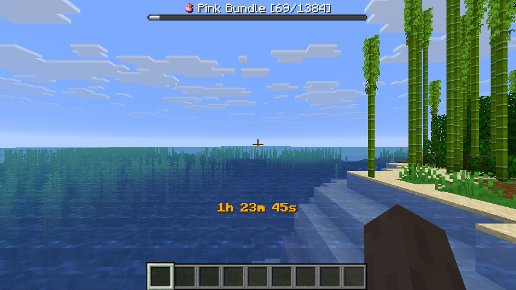

# Minecraft All Items

Collect all items in Minecraft, one at a time.

 

The mod randomly selects an item from all obtainable items and displays it in the bossbar.
Players must find and collect that item before moving on to the next one.
The mod is multiplayer compatible and designed to be played on a multiplayer server, but can also be played without a server.

## Getting Started

1. [Install Fabric](https://fabricmc.net/use/installer/)
2. Download [Fabric API](https://modrinth.com/mod/fabric-api) and put it in the mods folder
3. Download All Items from [Modrinth](https://modrinth.com/mod/all_items/versions) and put it in the mods folder

## Commands

- `/timer` - Pause or resume the game timer

## Config

The mod saves all progress in a config file located at `config/all-items.json`.
The config file contains the following options:

- **`showIcons` (boolean, default: false)** 
  Show item icons in the bossbar and in chat messages.
  This feature requires the [All-Icons](https://github.com/170yt/Minecraft-All-Icons-Resource-Pack) resource pack.
- **`timerSeconds` (integer)** 
  Stores the timer value in seconds.
- **`activeItem` (string)** 
  Stores the current active item id.
- **`obtainedItems` (array of strings)** 
  Stores the list of obtained item ids.
- **`unobtainableItems` (array of strings)** 
  Stores the list of unobtainable item ids.

## FAQ

- **How can I skip the current Item?** 
  Use the `/give` command to give yourself the item you want to skip.
- **Do I need to install the mod on the client side?** 
  No, the mod is server-side only and does not require the client to have it installed if it's already installed on the server. 
  The mod is designed to be played on a server with vanilla clients and does not require any client-side mods.
